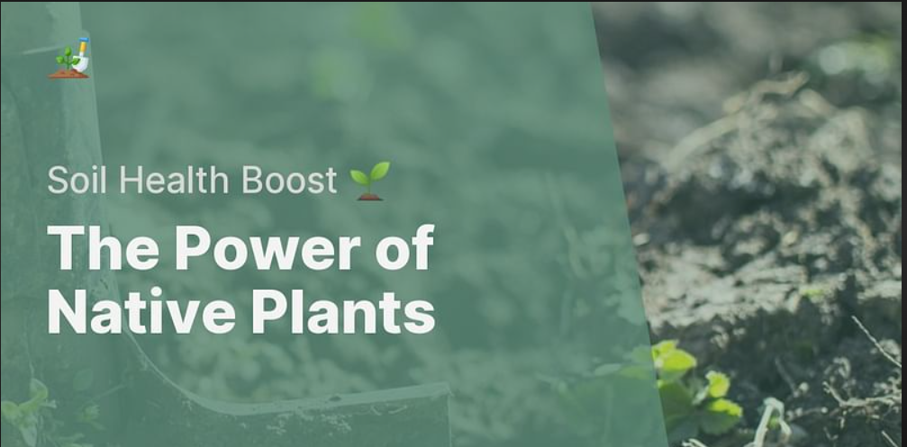

# 🌱 Soil Health Analyzer App
A comprehensive mobile-friendly application that analyzes soil health based on pH and NPK values and generates detailed soil deficiency reports using the Groq LLM API.



## Features

- Input and visualize soil parameters (pH, N, P, K) with real-time gauge charts
- Generate detailed soil deficiency reports with customized recommendations
- Compare your soil with ideal soil profiles for various crops using radar charts
- View similar soil profiles from the dataset
- Save and access your report history
- Download reports for offline reference
- Mobile-responsive user interface for use on any device
- Enhanced navigation with modern UI elements
- Beautiful plant imagery and visual design
- Settings management with theme preferences
- **Soil Analysis**: Generate detailed reports on soil health based on pH, Nitrogen, Phosphorus, and Potassium levels
- **Real-time Visualizations**: Interactive gauge charts for easy interpretation of soil parameters
- **Crop Recommendations**: AI-powered suggestions for suitable crops based on soil conditions
- **Mobile-Responsive UI**: Optimized for both desktop and mobile devices
- **Report History**: Save and review past soil analyses
- **Export Options**: Download reports in HTML format or share directly
- **Multiple Platforms**:
  - Web app (Streamlit)
  - Android app (Kivy)

## Requirements

- Python 3.8+
- Groq API Key (sign up at https://console.groq.com/)

## Installation

1. Clone this repository or download the files
2. Navigate to the `soil_analyzer` directory
3. Install the required dependencies:
   ```
   pip install -r requirements.txt
   ```
4. Add your Groq API key to the `.env` file:
   ```
   GROQ_API_KEY=your_groq_api_key_here
   ```

## Usage

1. Start the Streamlit application:
   ```
   streamlit run app.py
   ```
2. Open your browser and go to the URL provided in the terminal (usually http://localhost:8501)
3. Adjust the soil parameters using the sliders
4. Click "Analyze Soil" to generate a report
5. Navigate between different sections using the improved navigation buttons:
   - **Soil Analysis**: Input soil parameters and get reports
   - **Crop Recommendations**: View suitable crops for your soil
   - **Historical Reports**: View and reload past soil reports
   - **Help & Settings**: Configure app preferences and API key

## Mobile Usage

The application is designed to be fully responsive and works well on mobile devices:
1. Open the app URL on your mobile browser
2. The interface will automatically adjust to your screen size
3. Use touch gestures to interact with sliders and controls
4. Reports can be saved or shared directly from your mobile device
5. Enjoy enhanced navigation that's optimized for touch interfaces

## Data

The application uses the `soil_report_dataset_500.csv` dataset, which contains soil parameter values (pH, N, P, K) and corresponding crops along with detailed reports.

## How It Works

1. User inputs soil parameters via the UI
2. The app finds the most similar soil profiles in the dataset
3. Based on these matches, it sends a prompt to Groq's LLM (Llama 3 70B)
4. The LLM generates a comprehensive soil health report
5. Results are displayed in a user-friendly interface with visualizations
6. Reports are stored in history for future reference

## Customization

- You can modify the soil parameter ranges in the `soil_ranges` dictionary
- Change the LLM model by updating the `model` parameter in the Groq API call
- Customize the UI by modifying the CSS in the markdown section
- Add more languages by extending the language selection in settings

## Web App (Streamlit)

The web application is built with Streamlit and provides a comprehensive interface for soil analysis.

### Installation

1. Clone the repository:
   ```
   git clone https://github.com/yourusername/soil-health-analyzer.git
   cd soil-health-analyzer
   ```

2. Install dependencies:
   ```
   pip install -r requirements.txt
   ```

3. Configure your Groq API key:
   - Create a `.env` file in the root directory
   - Add your Groq API key: `GROQ_API_KEY=your_api_key_here`

4. Run the app:
   ```
   python run.py
   ```
   or
   ```
   streamlit run app.py
   ```

### Usage

1. Input your soil parameters (pH, N, P, K)
2. Click "Analyze Soil" to generate a report
3. View the detailed analysis, recommendations, and visualizations
4. Save or export your results as needed

## Android App (Kivy)

The Android application provides the same soil analysis capabilities in a native mobile format.

### Building the Android App

#### Prerequisites

- Python 3.8 or higher
- Buildozer
- Android SDK and NDK (automatically downloaded by Buildozer)

#### Build Instructions

1. Navigate to the Android app directory:
   ```
   cd soil_analyzer/android_app
   ```

2. Run the build script:
   ```
   build.bat   # Windows
   ```
   or
   ```
   python -m pip install -r requirements.txt
   buildozer android debug
   ```

3. The APK will be generated in the `bin` directory

### Android App Features

- Native Android interface optimized for mobile use
- Offline functionality with pre-generated reports
- Save and share soil reports
- History tracking
- Visual soil parameter gauges

## API Integration

The app uses the Groq API to generate custom soil health reports. If an API key is not provided, it falls back to pre-generated reports from the dataset.

## License

This project is licensed under the MIT License - see the LICENSE file for details.

## UI Features

- **Header Image**: A beautiful plant image at the top enhances visual appeal
- **Modern Navigation**: Easy-to-use button-based navigation
- **Responsive Design**: Adapts perfectly to desktop, tablet, and mobile screens
- **Interactive Elements**: Buttons and controls with hover effects and transitions
- **Beautiful Gauges**: Visualize soil parameters with interactive gauge charts
- **Card-Based Layout**: Content organized in clean, easy-to-read sections 