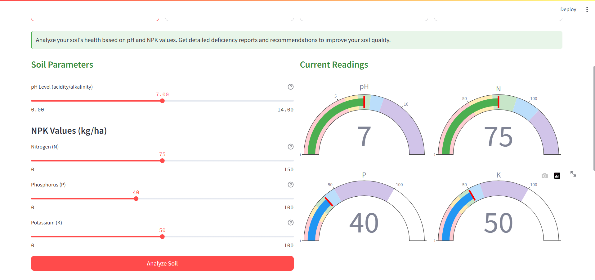

# 🌱 Soil Health Analyzer

[](https://python.org)
[](https://streamlit.io)
[](https://groq.com)
[](https://kivy.org)
[](LICENSE)

> A comprehensive **AI-powered soil analysis platform** that generates detailed soil health reports, crop recommendations, and deficiency analysis using **Groq LLM (Llama 3 70B)**. Available as both web and Android applications.



---

## 📋 Table of Contents

- [Overview](#-overview)
- [Features](#-features)
- [Tech Stack](#-tech-stack)
- [Installation](#-installation)
- [Usage](#-usage)
- [How It Works](#-how-it-works)
- [Project Structure](#-project-structure)
- [API Configuration](#-api-configuration)
- [Android App](#-android-app)
- [Contributing](#-contributing)
- [License](#-license)

---

## 🔍 Overview

The **Soil Health Analyzer** addresses critical challenges in agriculture:

- 🧪 **Complex soil testing** results that are hard to interpret
- 🌾 **Crop selection uncertainty** based on soil conditions
- 📊 **Lack of actionable insights** from raw soil data
- 🌍 **Accessibility issues** for farmers in remote areas

This platform transforms soil parameters into **actionable recommendations** using AI-powered analysis.

### What Makes It Unique

| Feature | Benefit |
|---------|---------|
| **AI-Powered Analysis** | Llama 3 70B generates human-readable reports |
| **Visual Dashboards** | Interactive gauge charts and radar plots |
| **Cross-Platform** | Web app + Android native app |
| **Offline History** | Save and review past analyses |
| **Crop Matching** | Compare soil with ideal profiles |

---

## ✨ Features

### 📊 Soil Analysis

| Feature | Description |
|---------|-------------|
| **Parameter Input** | pH, Nitrogen (N), Phosphorus (P), Potassium (K) |
| **Real-time Gauges** | Visual representation of soil parameters |
| **Deficiency Detection** | Identify nutrient deficiencies |
| **Health Score** | Overall soil health assessment |

### 🤖 AI-Powered Reports

| Feature | Description |
|---------|-------------|
| **Detailed Analysis** | Comprehensive soil health reports |
| **Crop Recommendations** | AI-suggested suitable crops |
| **Remediation Advice** | Steps to improve soil quality |
| **Scientific Explanations** | Understanding behind recommendations |

### 📈 Visualizations

| Feature | Description |
|---------|-------------|
| **Gauge Charts** | pH, N, P, K level indicators |
| **Radar Charts** | Compare with ideal soil profiles |
| **Similar Profiles** | Find matching soil types from dataset |
| **Trend Analysis** | Historical comparison (with saved reports) |

### 💾 Data Management

| Feature | Description |
|---------|-------------|
| **Report History** | Save and access past analyses |
| **Download Reports** | Export as HTML for offline use |
| **Share Functionality** | Share results directly |
| **Dataset Matching** | Compare against 500+ soil profiles |

---

## 🛠️ Tech Stack

| Category | Technologies |
|----------|--------------|
| **Web App** | Streamlit, Python 3.8+ |
| **Android App** | Kivy, KivyMD, Buildozer |
| **AI/LLM** | Groq API, Llama 3 70B |
| **Data Processing** | Pandas, NumPy |
| **Visualization** | Plotly, Matplotlib |
| **Styling** | Custom CSS, Mobile-responsive |

---

## 🚀 Installation

### Prerequisites

- Python 3.8+
- Groq API key ([Get free key](https://console.groq.com/))

### Web Application Setup

```bash
# Clone the repository
git clone https://github.com/0011Ashwin/Soil-Analyzer.git
cd Soil-Analyzer/soil_analyzer

# Create virtual environment
python -m venv venv
source venv/bin/activate  # Windows: venv\Scripts\activate

# Install dependencies
pip install -r requirements.txt

# Configure API key
echo "GROQ_API_KEY=your_groq_api_key_here" > .env

# Run the application
streamlit run app.py
# OR
python run.py
```

The app will open at `http://localhost:8501`

---

## 💻 Usage

### Web Application

1. **Open the app** in your browser
2. **Adjust soil parameters** using the sliders:
   - pH (0-14)
   - Nitrogen - N (0-150 kg/ha)
   - Phosphorus - P (0-150 kg/ha)
   - Potassium - K (0-150 kg/ha)
3. **Click "Analyze Soil"** to generate report
4. **Explore the results**:
   - View gauge visualizations
   - Read AI-generated analysis
   - See crop recommendations
   - Compare with ideal profiles
5. **Save or download** your report

### Navigation Sections

| Section | Purpose |
|---------|---------|
| **Soil Analysis** | Input parameters and generate reports |
| **Crop Recommendations** | View suitable crops for your soil |
| **Historical Reports** | Access saved analyses |
| **Help & Settings** | Configure API key and preferences |

### Mobile Usage

The web app is **fully responsive**:
- Touch-friendly sliders
- Optimized for small screens
- Swipe-friendly navigation
- One-tap report generation

---

## ⚙️ How It Works

### Analysis Pipeline

```
User Input          Data Processing         AI Analysis           Output
    │                     │                      │                  │
    ▼                     ▼                      ▼                  ▼
┌─────────┐        ┌─────────────┐        ┌─────────────┐    ┌──────────┐
│ pH, N,  │───────▶│ Find Similar│───────▶│ Groq API    │───▶│ Report + │
│ P, K    │        │ Soil Profiles│       │ (Llama 3)   │    │ Visuals  │
│ Values  │        │ from Dataset │        │ Generate    │    │          │
└─────────┘        └─────────────┘        │ Report      │    └──────────┘
                                          └─────────────┘
```

### Soil Parameter Ranges

| Parameter | Range | Optimal | Unit |
|-----------|-------|---------|------|
| **pH** | 0-14 | 6.0-7.0 | - |
| **Nitrogen (N)** | 0-150 | 50-100 | kg/ha |
| **Phosphorus (P)** | 0-150 | 25-50 | kg/ha |
| **Potassium (K)** | 0-150 | 100-150 | kg/ha |

### AI Prompt Engineering

The system constructs prompts including:
- Current soil parameters
- Similar soil profiles from dataset
- Crop growing requirements
- Regional agricultural practices

---

## 📁 Project Structure

```
Soil-Analyzer/
├── README.md                      # Project documentation
├── Main-dashboard.png             # Dashboard screenshot
├── plant.png                      # App header image
│
└── soil_analyzer/                 # Main application
    ├── app.py                     # Streamlit web application
    ├── run.py                     # Application runner
    ├── requirements.txt           # Python dependencies
    ├── plant.png                  # UI image asset
    ├── soil_report_dataset_500.csv # Soil profiles dataset
    │
    ├── android_app/               # Android application
    │   ├── main.py                # Kivy main application
    │   ├── buildozer.spec         # Android build config
    │   └── build.bat              # Windows build script
    │
    └── README.md                  # Detailed usage guide
```

---

## 🔑 API Configuration

### Groq API Setup

1. **Get API Key**: Visit [console.groq.com](https://console.groq.com/)
2. **Create Account**: Sign up for free
3. **Generate Key**: Create new API key
4. **Configure**:
   
   Option A: Environment file
   ```bash
   echo "GROQ_API_KEY=gsk_your_key_here" > .env
   ```
   
   Option B: In-app settings
   - Go to **Help & Settings**
   - Enter API key in the field
   - Click Save

### API Usage

| Model | Context | Speed | Free Tier |
|-------|---------|-------|-----------|
| Llama 3 70B | 8K tokens | Fast | ✅ Yes |

---

## 📱 Android App

### Building the APK

#### Prerequisites
- Linux or WSL (Windows Subsystem for Linux)
- Python 3.8+
- Android SDK/NDK (auto-downloaded)

#### Build Steps

```bash
# Navigate to Android app directory
cd soil_analyzer/android_app

# Install Buildozer
pip install buildozer

# Initialize (first time only)
buildozer init

# Build debug APK
buildozer android debug

# OR use the build script (Windows)
build.bat
```

The APK will be in `bin/` directory.

### Android App Features

- Native mobile UI with KivyMD
- Offline mode for basic features
- Camera integration (future)
- Local report storage

---

## 🧪 Dataset

The app includes a dataset of **500 soil profiles**:

| Column | Description |
|--------|-------------|
| `pH` | Soil pH value |
| `N` | Nitrogen content |
| `P` | Phosphorus content |
| `K` | Potassium content |
| `crop` | Suitable crop |
| `report` | Analysis report |

### Adding Custom Data

```python
# Add new profiles to CSV
new_data = {
    'pH': 6.5,
    'N': 80,
    'P': 40,
    'K': 120,
    'crop': 'Wheat',
    'report': 'Detailed analysis...'
}
```

---

## 🤝 Contributing

Contributions are welcome! Here's how to get started:

1. **Fork** the repository
2. **Create** a feature branch (`git checkout -b feature/SoilMapping`)
3. **Commit** your changes (`git commit -m 'Add GPS soil mapping'`)
4. **Push** to the branch (`git push origin feature/SoilMapping`)
5. **Open** a Pull Request

### Ideas for Contributions

- [ ] GPS-based soil mapping
- [ ] Image-based soil analysis
- [ ] Multi-language support
- [ ] Integration with soil testing labs
- [ ] Weather correlation analysis
- [ ] Fertilizer calculator

---

## 📄 License

This project is licensed under the MIT License - see the [LICENSE](LICENSE) file for details.

---

## 🙏 Acknowledgments

- **Groq** for high-speed LLM inference
- **Streamlit** for the web framework
- **Kivy** for cross-platform mobile development
- Agricultural research datasets and soil science community

---

## 📚 References

- [Soil pH and Plant Nutrients](https://extension.psu.edu/)
- [NPK Guide for Crops](https://www.fao.org/)
- [Groq API Documentation](https://console.groq.com/docs)

---

<p align="center">
  Made with ❤️ for sustainable agriculture
  <br>
  <a href="https://github.com/0011Ashwin">@0011Ashwin</a>
</p>
